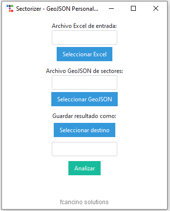
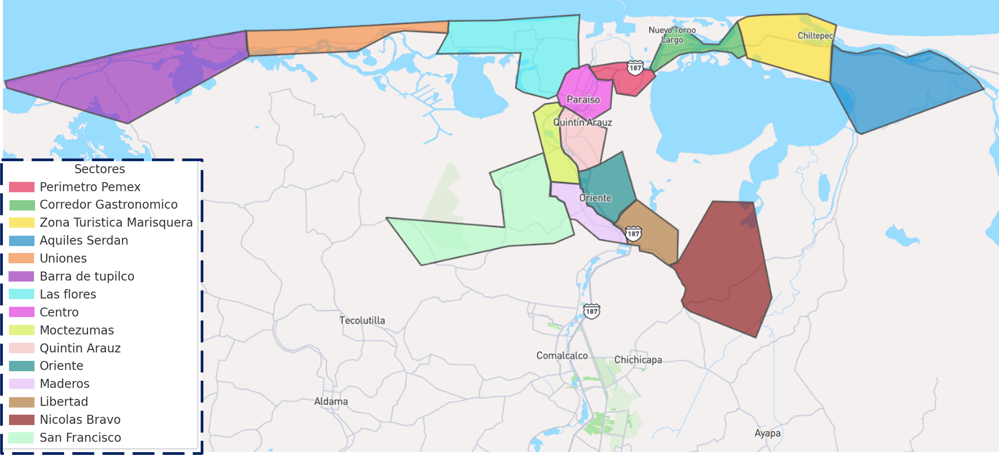

# GeoAnalyzer

GeoAnalyzer is a robust tool designed for processing and analyzing GPS tracking data from Excel reports. It enables users to segment vehicle location data into half-hour intervals and map coordinates to predefined geographic zones using GeoJSON polygons.

<div style="display: flex; flex-direction: column; gap:10px; text-align: left;">
 
 <br>
</div>


## Geojson Example


## Features

- **Multi-file Processing:** Handles multiple Excel files (.xls, .xlsx) containing GPS tracking data.
- **Geospatial Analysis:** Maps GPS coordinates to zones defined in a GeoJSON file.
- **Time Segmentation:** Aggregates and segments data into customizable half-hour intervals.
- **Consolidated Output:** Generates a comprehensive report for further analysis.

## Prerequisites

- GPS tracking app that exports reports in Excel format (.xls or .xlsx) with datetime, coordinates, and IMEI information.
- GeoJSON file containing polygons that represent geographic zones.

## Installation

Install the required Python libraries:

```bash
pip install pandas shapely tkinter ttkbootstrap
```

If you need to package the application as a standalone executable, install PyInstaller:

```bash
pip install PyInstaller
```

## Packaging

To build a standalone executable with PyInstaller, use the following command:

```bash
pyinstaller --onefile --windowed --icon=logo.ico --collect-data shapely --collect-binaries shapely --collect-data matplotlib --collect-binaries matplotlib --collect-data ttkbootstrap --hidden-import xlrd --exclude-module matplotlib.tests --exclude-module shapely.tests --exclude-module PIL.tests --clean --noconfirm sectorizer_v5.py

```
## Usage

1. Prepare your Excel reports and GeoJSON file.
2. Run the application and select the files to process.
3. Review the generated output for segmented and mapped GPS data.

## Contributing

Contributions are welcome! Please open issues or submit pull requests for improvements and bug fixes.

## Contact

For questions or support, please open an issue in this repository.

